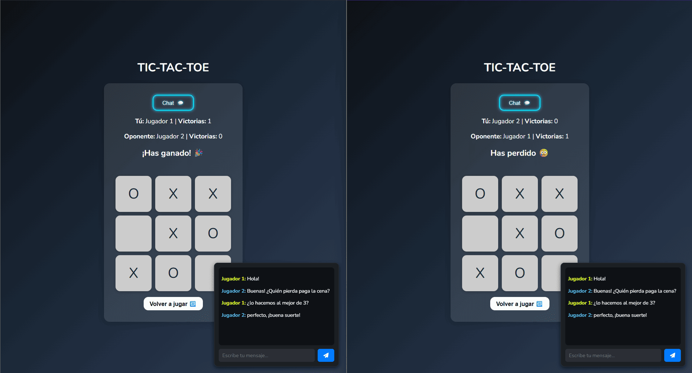

# 🎮 Tic-tac-toe con Chat en Tiempo Real

> Clásico juego de 3 en raya en modo multijugador con chat integrado y sincronización en tiempo real.

## 📝 Descripción

**Tic-tac-toe con Chat en Tiempo Real** es una aplicación web que reimagina el clásico juego del 3 en raya con una experiencia multijugador moderna. Dos usuarios pueden conectarse simultáneamente para jugar mientras chatean en tiempo real, gracias a la integración de WebSockets.

La partida no comienza hasta que dos jugadores están conectados. Se incluye toda la lógica necesaria para gestionar los turnos, el estado del juego, detectar ganadores o empates, y sincronizar el tablero en ambos extremos. Además, incorpora un chat en vivo que funciona durante toda la sesión de juego.

---

## 🚀 Funcionalidades

- ✅ Juego multijugador online de Tic-tac-toe
- 🔁 Sincronización en tiempo real entre clientes
- 💬 Chat integrado en vivo
- ⏱ Gestión de turnos y estados del juego
- 🔒 Control de conexiones (solo se permite el juego con 2 jugadores activos)
- 🧠 Lógica completa de validación y finalización de partidas

---

## 🛠 Tecnologías utilizadas

### Frontend
- **HTML5 / CSS3 / JavaScript**
- **WebSockets (cliente)**

### Backend
- **Node.js**
- **Express**
- **WebSocket (API nativa)**

---

## 📦 Instalación

\`\`\`bash
# Clona el repositorio
git clone https://github.com/gagoxyz/tic-tac-toe-socket.git

# Entra en el directorio del proyecto
cd tic-tac-toe-realtime

# Instala las dependencias
npm install

# Inicia el servidor
npm start
\`\`\`

El servidor se iniciará por defecto en \`http://localhost:3000\`. Abre esa dirección en dos pestañas o en dos navegadores diferentes para comenzar una partida.

---

## 🌐 Uso

1. Abre la aplicación en dos ventanas (simulando dos jugadores).
2. Espera a que ambos estén conectados: la partida no empezará hasta entonces.
3. Cada jugador realiza su jugada por turnos.
4. El chat puede utilizarse en cualquier momento para comunicarse.
5. Al terminar la partida, los jugadores pueden reiniciar y seguir jugando.

---

## ✨ Capturas

### 🎲 Tablero en tiempo real

### 💬 Chat multijugador

---

## 🤝 Contribuciones

Las contribuciones son bienvenidas. Si deseas mejorar la funcionalidad, reportar errores o sugerir nuevas características, no dudes en abrir un [issue](https://github.com/gagoxyz/tic-tac-toe-socket/issues) o enviar un pull request.

---

## 🧠 Autor

Desarrollado por **[Gagoxyz]** – ¡gracias por jugar!
